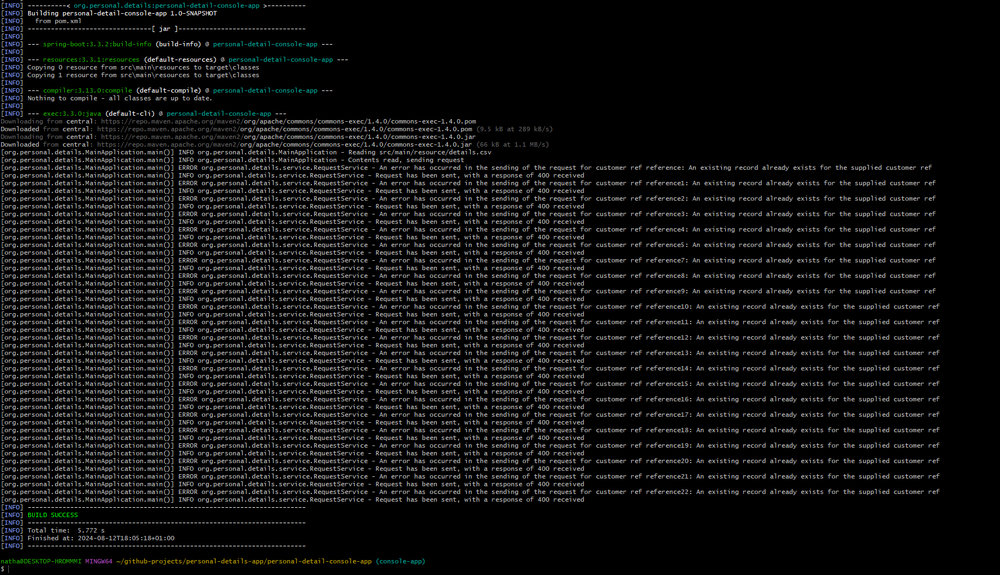

# Personal Details Console App

<!-- TOC -->

* [Personal Details Console App](#personal-details-console-app)
    * [What does this App do?](#what-does-this-app-do)
        * [Where is the file for it to read?](#where-is-the-file-for-it-to-read)
    * [Technologies Used](#technologies-used)
    * [How to build](#how-to-build)

<!-- TOC -->

## What does this App do?

It will attempt to save Personal Details of someone as one endpoint, and will also fetch details as another endpoint.

### Where is the file for it to read?

The App has been designed to read the contents of: [Details.csv](src/main/resources/details.csv)

## Technologies Used

- Java 21
- Maven
- Spring Boot 3

## How to build

- Navigate to directory in git bash
- Run the following command, which will download all dependencies necessary:
  ```shell
  mvn clean install
  ```
- Run the following command, which will run the API
  ```shell
  mvn spring-boot:run

The below shows what the output will look like if everything is successful:


```