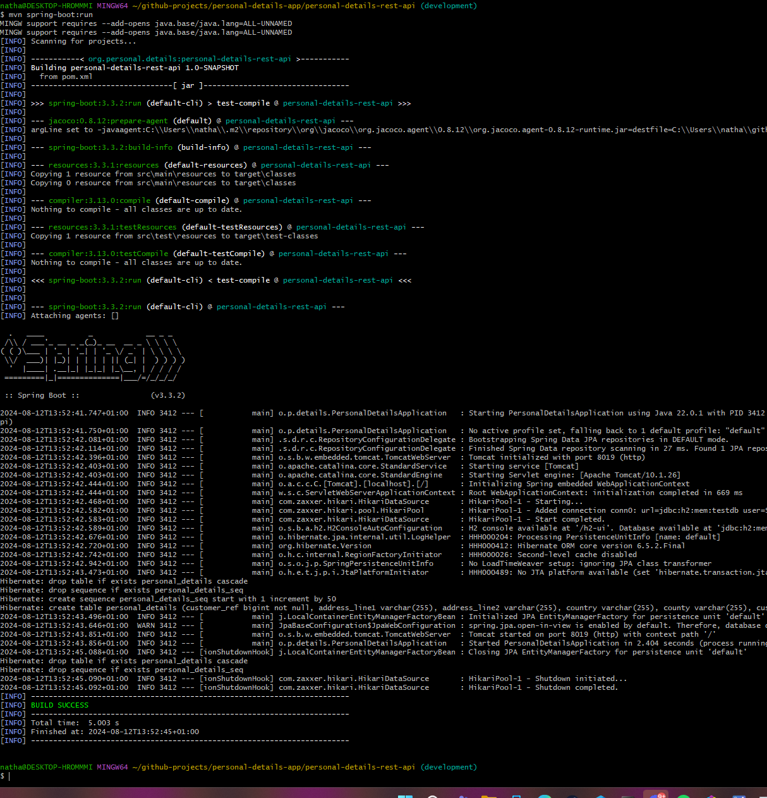

# Personal Details Rest API

<!-- TOC -->

* [Personal Details Rest API](#personal-details-rest-api)
    * [What does this API do?](#what-does-this-api-do)
    * [Technologies Used](#technologies-used)
    * [Endpoint Details](#endpoint-details)
        * [Prefix](#prefix)
        * [Actual Endpoints](#actual-endpoints)
            * [Save Details Endpoint](#save-details-endpoint)
                * [Minimum Payload](#minimum-payload)
                * [Expected Return Status Codes](#expected-return-status-codes)
            * [Get Details Endpoint](#get-details-endpoint)
                * [Expected Response Payload](#expected-response-payload)
                * [Expected Return Status Codes](#expected-return-status-codes-1)
    * [Notes](#notes)
    * [How to build](#how-to-build)

<!-- TOC -->

## What does this API do?

It will attempt to save Personal Details of someone as one endpoint, and will also fetch details as another endpoint.

## Technologies Used

- Java 21
- Maven
- Spring Boot 3
- H2 Database (in place of SQL Database)

## Endpoint Details

### Open API Docs

The Open API Docs can be found on the following endpoint:

```
http://localhost:8019/api-docs
```

### Prefix for Other Endpoints

The prefix for all endpoints is: personal-details

### Actual Endpoints

#### Save Details Endpoint

This endpoint takes a [Personal Details](src/main/java/org/personal/details/model/PersonalDetailsDTO.java) payload
which will then check if the supplied customer reference exists.
If it doesn't, then the data will be saved to a database.

The detail full endpoint for this is:

 ```
 /personal-details/save
  ```

##### Minimum Payload

The minimum payload must consist of:

- A Customer Ref
- A Customer Name
- Address Line 1
- Town
- Postcode

This is due to the standard input of data

##### Expected Return Status Codes

- 201 - The record was successfully created
- 422 - The record could not be processed

#### Get Details Endpoint

This endpoint takes a request param of customer reference.

The Application will then check to see if a customer exists with the supplied param.

If there isn't, then a 404 NOT FOUND will be returned.

If there is, the data will be returned as JSON in a 200 OK Response

The detail full endpoint for this is:

 ```
 /personal-details/get/CUSTOMER_REF_HERE
  ```

##### Expected Response Payload

 ```json
 {
  "customerRef": "YXhXfUOAJEleNfBQzvxF",
  "customerName": "Doe John",
  "addressLine1": "AL1",
  "addressLine2": null,
  "town": "Town",
  "county": null,
  "country": null,
  "postcode": "BF1 BF2"
}
  ```

##### Expected Return Status Codes

- 200 - The record was found
- 422 - The record could not be processed

## Notes

Note that all sensitive data in encrypted so no personal details should be able to be obtained.

Note that ToString.Excludes have been included in the application to intentionally hide any sensitive data when doing a
toString on the objects

## How to build

- Navigate to directory in git bash
- Run the following command, which will download all dependencies necessary:
  ```shell
  mvn clean install
  ```
- Run the following command, which will run the API
  ```shell
  mvn spring-boot:run

The below shows what the output will look like if everything is successful:


```